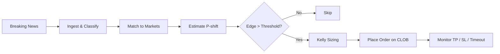
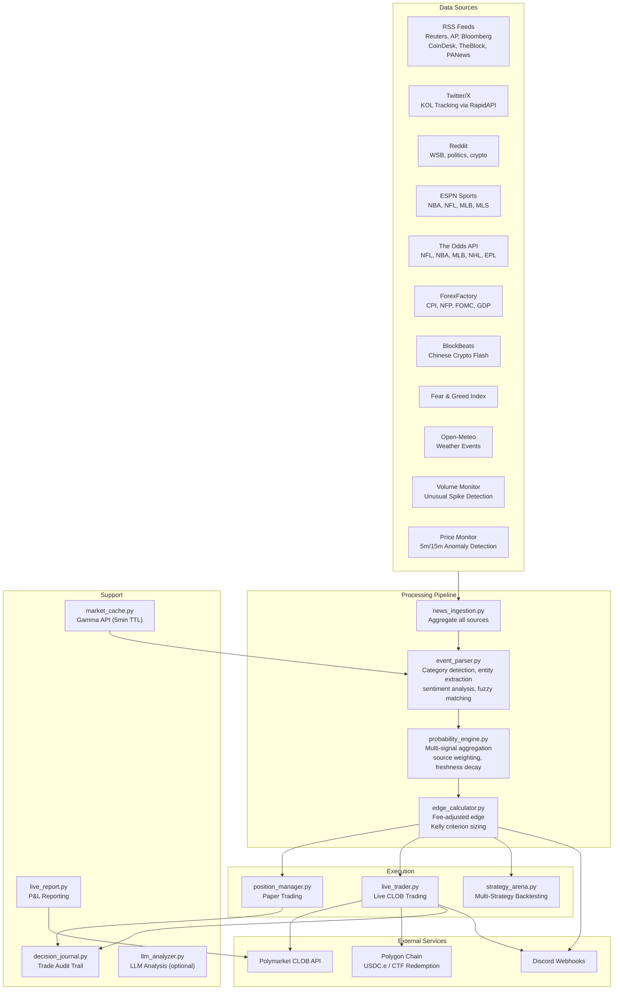
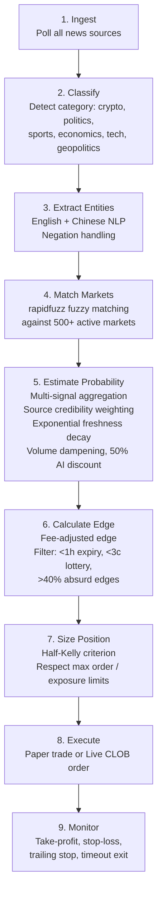

# Polyclaw

**[polyclaw.cloud](https://polyclaw.cloud/)**

AI-powered news edge scanner and auto-trader for [Polymarket](https://polymarket.com) prediction markets. Ingests news from 10+ sources in real-time, matches headlines to active markets, estimates probability shifts, calculates fee-adjusted edges using Kelly criterion, and auto-trades via Polymarket's CLOB API on Polygon.

## Table of Contents

- [How It Works](#how-it-works)
- [Architecture](#architecture)
- [Signal Pipeline](#signal-pipeline)
- [Strategies](#strategies)
- [Quick Start](#quick-start)
- [Environment Variables](#environment-variables)
- [Configuration](#configuration)
- [Project Structure](#project-structure)
- [Running Modes](#running-modes)
- [Safety Controls](#safety-controls)
- [Extending](#extending)
- [Disclaimer](#disclaimer)
- [License](#license)

## How It Works

The core thesis: **breaking news moves prediction market probabilities before market prices adjust**. Polyclaw exploits this information lag by:

1. Continuously polling 10+ news sources every 90 seconds
2. Matching news items to 500+ active Polymarket markets using category-aware fuzzy matching
3. Estimating the probability shift each news item implies
4. Calculating fee-adjusted edge with a conservative AI discount
5. Sizing positions using Half-Kelly criterion
6. Placing limit orders on Polymarket's CLOB and managing exits automatically



## Architecture



## Signal Pipeline

Each scan cycle (default: every 90 seconds) runs this pipeline:



## Strategies

Five strategy variants run simultaneously in the Strategy Arena. Each processes the same signals with different risk parameters:

| Strategy | Kelly | AI Discount | Min Edge | Take Profit | Stop Loss | Timeout | Max Positions |
|---|---|---|---|---|---|---|---|
| **baseline** | 50% | 50% | 2% | 70% | 75% | 24h | 8 |
| **aggressive** | 75% | 70% | 1% | 85% | 65% | 24h | 12 |
| **conservative** | 25% | 30% | 4% | 55% | 85% | 24h | 5 |
| **sniper** | 50% | 50% | 6% | 50% | 82% | 6h | 4 |
| **trend_follower** | 50% | 50% | 3% | 90% | 70% | 48h | 10 |

**Default active strategy for live trading: `sniper`** (configurable via `config.yaml` or `--strategy` flag).

The Strategy Arena paper-trades all five variants simultaneously so you can compare performance before switching your live strategy.

## Quick Start

### Prerequisites

- Python 3.10+
- A Polygon wallet with USDC.e balance (for live trading)
- Git

### 1. Clone and install

```bash
git clone https://github.com/arkyu2077/polyclaw.git
cd polyclaw
./setup.sh
```

`setup.sh` creates a virtual environment, installs dependencies, and creates a `.env` file from `.env.example`.

### 2. Configure your wallet

```bash
nano .env
```

Set `POLYMARKET_PRIVATE_KEY` (with `0x` prefix). This is the Polygon wallet that will sign CLOB orders. Optionally add `DISCORD_WEBHOOK_URL`, `TWITTER_RAPIDAPI_KEYS`, and `ODDS_API_KEY`.

### 3. Derive CLOB credentials

```bash
./setup.sh
```

Run setup again after adding your private key. It auto-derives `POLYMARKET_CLOB_API_KEY`, `POLYMARKET_CLOB_API_SECRET`, `POLYMARKET_CLOB_API_PASSPHRASE`, and `POLYMARKET_WALLET_ADDRESS` and writes them to `.env`.

### 4. (Optional) Tune strategy parameters

Copy and edit `config.example.yaml` for non-secret strategy settings:

```bash
cp config.example.yaml config.yaml
nano config.yaml
```

Adjust `min_edge`, `max_order_size`, `strategy`, etc. These are optional — sensible defaults are built in.

### 5. Run the scanner

```bash
# Paper trading mode (default) — no real orders
./run.sh

# Or run manually with options:
source .venv/bin/activate
python3 src/scanner.py --monitor --interval 90

# Enable live trading:
python3 src/scanner.py --monitor --interval 90 --live --strategy sniper

# With LLM analysis (requires external Claude CLI):
python3 src/scanner.py --monitor --interval 90 --use-llm
```

### 6. Monitor

```bash
# Follow scanner logs
tail -f data/scanner.log

# Set DISCORD_WEBHOOK_URL in .env for real-time trade alerts
```

## Environment Variables

Secrets **must** be set via environment variables (in `.env`). Non-secret strategy parameters can optionally be set in `config.yaml`.

| Variable | Required | Default | Description |
|---|---|---|---|
| `POLYMARKET_PRIVATE_KEY` | Yes* | — | Polygon wallet private key (0x-prefixed) |
| `POLYMARKET_WALLET_ADDRESS` | Yes* | — | Polygon wallet address |
| `POLYMARKET_CLOB_API_KEY` | Auto | — | Auto-derived by `setup.sh` |
| `POLYMARKET_CLOB_API_SECRET` | Auto | — | Auto-derived by `setup.sh` |
| `POLYMARKET_CLOB_API_PASSPHRASE` | Auto | — | Auto-derived by `setup.sh` |
| `DISCORD_WEBHOOK_URL` | No | — | Discord webhook for trade signal notifications |
| `TWITTER_RAPIDAPI_KEYS` | No | — | Comma-separated RapidAPI keys for Twitter/X |
| `ODDS_API_KEY` | No | — | [The Odds API](https://the-odds-api.com) key for sports odds |
| `POLYGON_RPC_URL` | No | `https://polygon-bor-rpc.publicnode.com` | Polygon RPC endpoint |
| `INITIAL_BANKROLL` | No | `1000.0` | Starting capital for position sizing |
| `DATA_DIR` | No | `./data` | Directory for positions, cache, and logs |

*Required via either env var or `config.yaml`.

## Configuration

Strategy parameters and safety limits are configured in `config.yaml`. See `config.example.yaml` for the full template.

Key settings:

```yaml
# Active strategy for live trading
strategy: "sniper"           # sniper | baseline | conservative | aggressive | trend_follower

# Starting capital for position sizing
bankroll: 1000.0

# Safety limits
max_order_size: 15.0         # Max USD per order
daily_loss_limit: 30.0       # Stop trading if daily loss exceeds this
max_positions: 4             # Max concurrent open positions
max_exposure_pct: 1.0        # Max total exposure as fraction of bankroll
min_edge: 0.02               # Minimum edge after fees to open (0.02 = 2%)

# Data sources
twitter_rapidapi_keys: []    # RapidAPI keys for Twitter/X (rotate for rate limits)

# Notifications
discord_webhook: ""          # Discord webhook URL for trade alerts
```

## Project Structure

```
polyclaw/
├── src/                              # Main source code
│   ├── scanner.py                    # Main orchestrator — entry point, scan loop
│   ├── config.py                     # Configuration loader (env vars + yaml)
│   ├── news_ingestion.py             # RSS feeds + BlockBeats + Fear&Greed + Weather
│   ├── twitter_source.py             # Twitter/X KOL tracking via RapidAPI
│   ├── reddit_source.py              # Reddit public API (WSB, politics, crypto)
│   ├── sports_data.py                # ESPN scores and injury reports
│   ├── sports_odds.py                # The Odds API (NFL, NBA, MLB, NHL, EPL)
│   ├── economic_calendar.py          # ForexFactory economic events (CPI, NFP, FOMC)
│   ├── volume_monitor.py             # Unusual volume spike detection on Polymarket
│   ├── price_monitor.py              # 5min/15min price anomaly detection
│   ├── weather_source.py             # Open-Meteo weather data for event markets
│   ├── event_parser.py               # News-to-market matching engine (fuzzy + NLP)
│   ├── probability_engine.py         # Multi-signal probability aggregation
│   ├── edge_calculator.py            # Fee-adjusted edge calculation + Kelly criterion
│   ├── position_manager.py           # Paper trading position manager (TP/SL/trailing)
│   ├── live_trader.py                # Live CLOB trading (orders, fills, redemption)
│   ├── strategy_arena.py             # Multi-strategy simultaneous backtesting
│   ├── market_cache.py               # Polymarket market cache via Gamma API (5min TTL)
│   ├── decision_journal.py           # Structured trade audit trail
│   ├── llm_analyzer.py               # LLM analysis integration (file-based IPC)
│   └── live_report.py                # P&L reporting from CLOB trades + on-chain
├── scripts/                          # Standalone utility scripts
├── polymarket_news_edge/             # Installable package version
├── examples/                         # Usage examples
├── config.example.yaml               # Strategy parameter template
├── .env.example                      # Environment variables template
├── run.sh                            # Start scanner as background daemon
├── setup.sh                          # One-time setup + CLOB credential derivation
├── requirements.txt                  # Python dependencies
├── pyproject.toml                    # Package metadata
└── LICENSE                           # MIT License
```

## Running Modes

### Paper Trading (default)

No real orders are placed. The position manager simulates entries and exits using live market prices. Use this to evaluate strategy performance before going live.

```bash
python3 src/scanner.py --monitor --interval 90
```

### Live Trading

Places real limit orders on Polymarket's CLOB. Requires derived CLOB credentials and USDC.e balance.

```bash
python3 src/scanner.py --monitor --interval 90 --live --strategy sniper
```

### Strategy Arena

All five strategy variants paper-trade every signal simultaneously. Compare their P&L to pick the best variant for your live strategy.

The arena runs automatically alongside the main scanner. Results are stored in `src/arena/`.

### CLI Arguments

| Flag | Description |
|---|---|
| `--monitor` | Run continuously (default: single scan then exit) |
| `--interval N` | Seconds between scan cycles (default: 90) |
| `--live` | Enable live CLOB trading |
| `--strategy NAME` | Active strategy: `sniper`, `baseline`, `conservative`, `aggressive`, `trend_follower` |
| `--use-llm` | Enable LLM-assisted analysis (requires external setup) |
| `--llm-only` | Skip keyword matching, use only LLM analysis |

## Safety Controls

Multiple layers prevent runaway losses:

- **Max order size**: $15 per order (configurable)
- **Daily loss limit**: $30 realized loss triggers automatic trading halt
- **Max concurrent positions**: 4 (sniper) to 12 (aggressive)
- **Half-Kelly sizing**: Never bets more than half of Kelly-optimal, reducing variance
- **50% AI discount**: Probability estimates are blended 50/50 toward market price
- **Edge filters**: Rejects edges > 40% (likely bad data), sub-3-cent lottery tickets, and markets expiring within 1 hour
- **Signal cooldown**: 4-hour dedup window prevents repeated alerts on the same market
- **Rate limiting**: Max 5 alerts per hour to Discord
- **Trailing stops**: Locks in gains after position reaches activation threshold
- **Timeout exits**: Auto-close positions after strategy-specific timeout (6h-48h)
- **Auto-redemption**: Resolved winning positions are automatically redeemed on-chain

## Extending

### Adding a New Data Source

1. Create a new file in `src/` (e.g., `src/my_source.py`)
2. Implement a function that returns a list of news item dicts with keys: `title`, `summary`, `source`, `published`, `link`, `category`
3. Import and call it in `scanner.py`'s `run_scan()` function alongside the other sources

### Creating a New Strategy

1. Add a new `StrategyConfig` entry to the `STRATEGIES` dict in `src/strategy_arena.py`
2. Tune parameters: `kelly_fraction`, `ai_discount`, `min_edge`, `tp_ratio`, `sl_ratio`, `timeout_hours`, `max_open_positions`
3. The arena will automatically paper-trade your new strategy alongside existing ones
4. Once validated, set it as active via `--strategy your_name` or in `config.yaml`

### Adding a New Market Category

1. Add your category keywords to the `CATEGORY_KEYWORDS` dict in `src/event_parser.py`
2. The fuzzy matcher will automatically include markets matching your new category

## Disclaimer

This software is provided for **educational and research purposes only**.

- This is **not financial advice**. Prediction market trading involves significant risk of loss.
- Past performance of any strategy does not guarantee future results.
- The authors are not responsible for any financial losses incurred while using this software.
- You are solely responsible for compliance with applicable laws and regulations in your jurisdiction.
- Polymarket may not be available in all jurisdictions. Check local regulations before trading.
- Always start with paper trading mode to understand the system before risking real capital.

**Use at your own risk.**

## License

[MIT](LICENSE) &copy; 2026 arkYu
