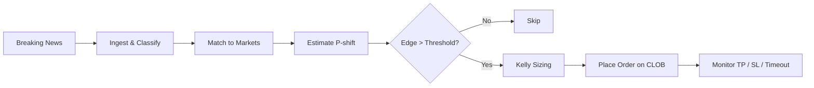
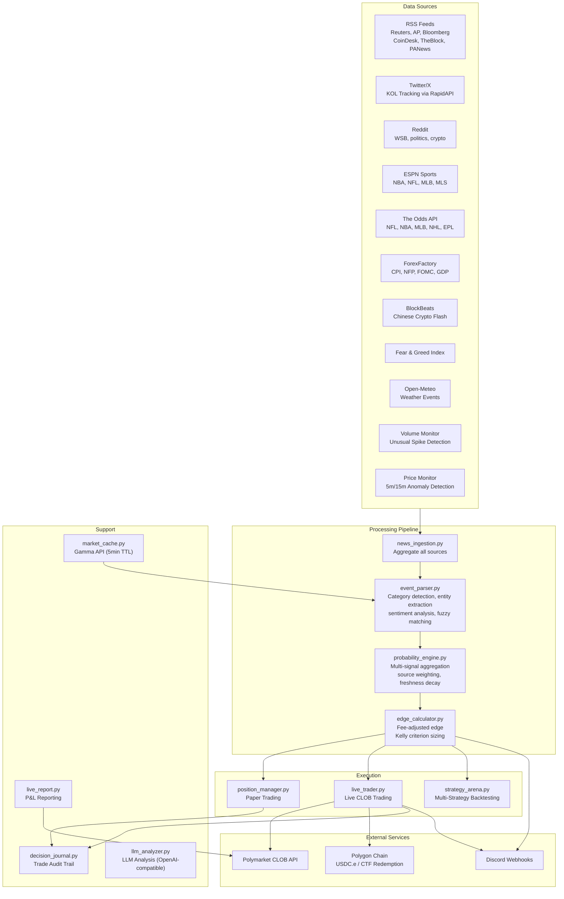

# Polyclaw

**[polyclaw.cloud](https://polyclaw.cloud/)**

AI-powered news edge scanner and auto-trader for [Polymarket](https://polymarket.com) prediction markets. Ingests news from 10+ sources in real-time, matches headlines to active markets, estimates probability shifts, calculates fee-adjusted edges using Kelly criterion, and auto-trades via Polymarket's CLOB API on Polygon.

## Table of Contents

- [How It Works](#how-it-works)
- [Architecture](#architecture)
- [Quick Start](#quick-start)
- [Configuration](#configuration)
- [Running Modes](#running-modes)
- [OpenClaw Integration](#openclaw-integration)
- [Safety Controls](#safety-controls)
- [Extending](#extending)
- [Disclaimer](#disclaimer)

## How It Works

**Core thesis: breaking news moves prediction market probabilities before market prices adjust.** Polyclaw exploits this information lag:

1. Poll 10+ news sources every 90 seconds
2. Match news to 500+ active markets via category-aware fuzzy matching + LLM analysis
3. Estimate probability shifts, calculate fee-adjusted edges
4. Size positions using Half-Kelly criterion
5. Place limit orders on Polymarket's CLOB, manage exits automatically



## Architecture



## Quick Start

```bash
# 1. Clone and install
git clone https://github.com/arkyu2077/polyclaw.git
cd polyclaw
./setup.sh              # creates .venv, installs deps, creates .env from template

# 2. Configure (edit .env)
nano .env               # set POLYMARKET_PRIVATE_KEY (0x-prefixed)

# 3. Derive CLOB credentials
./setup.sh              # re-run after adding private key — auto-derives CLOB creds

# 4. (Recommended) Configure LLM — without this, only keyword matching is used
# Add to .env:
#   LLM_PROVIDER=openai
#   LLM_BASE_URL=http://127.0.0.1:8045/v1
#   LLM_API_KEY=sk-your-key
#   LLM_MODEL=gemini-3.1-pro-high

# 5. Run
./run.sh                # paper trading, foreground, Ctrl+C to stop
```

> **Tip**: Without `POLYMARKET_PRIVATE_KEY`, the scanner runs in paper-only mode.
> Without `LLM_*` variables, signals come from keyword matching only (significantly fewer).

## Configuration

### Environment Variables (`.env`)

Secrets **must** be set in `.env`. Non-secret strategy params go in `config.yaml`.

| Variable | Required | Description |
|---|---|---|
| `POLYMARKET_PRIVATE_KEY` | Yes | Polygon wallet private key (0x + 64 hex chars) |
| `POLYMARKET_WALLET_ADDRESS` | Auto | Auto-derived by `setup.sh` |
| `POLYMARKET_CLOB_API_KEY` | Auto | Auto-derived by `setup.sh` |
| `POLYMARKET_CLOB_API_SECRET` | Auto | Auto-derived by `setup.sh` |
| `POLYMARKET_CLOB_API_PASSPHRASE` | Auto | Auto-derived by `setup.sh` |
| `LLM_PROVIDER` | Recommended | `"openai"` for any OpenAI-compatible endpoint |
| `LLM_BASE_URL` | Recommended | e.g. `http://127.0.0.1:8045/v1` (local proxy) |
| `LLM_API_KEY` | Recommended | API key for LLM endpoint |
| `LLM_MODEL` | Recommended | e.g. `gemini-3.1-pro-high`, `gpt-4o-mini` |
| `DISCORD_WEBHOOK_URL` | Optional | Discord webhook for trade alerts |
| `TWITTER_RAPIDAPI_KEYS` | Optional | Comma-separated RapidAPI keys for Twitter/X |
| `ODDS_API_KEY` | Optional | [The Odds API](https://the-odds-api.com) key |
| `POLYGON_RPC_URL` | Optional | Default: `https://polygon-bor-rpc.publicnode.com` |
| `INITIAL_BANKROLL` | Optional | Default: `1000.0` |
| `DATA_DIR` | Optional | Default: `./data` |

### Strategy Parameters (`config.yaml`)

Copy `config.example.yaml` to `config.yaml` to override defaults. Key settings:

```yaml
strategy: "sniper"           # sniper | baseline | conservative | aggressive | trend_follower
bankroll: 1000.0
max_order_size: 15.0         # max USD per order
daily_loss_limit: 30.0       # stop trading if daily loss exceeds this
max_positions: 4             # max concurrent open positions
min_edge: 0.02               # minimum edge after fees (2%)
```

See `config.example.yaml` for the full template with all tunable parameters.

### Strategies

Five variants run simultaneously in the Strategy Arena:

| Strategy | Kelly | AI Discount | Min Edge | TP | SL | Timeout | Max Pos |
|---|---|---|---|---|---|---|---|
| **baseline** | 50% | 50% | 2% | 70% | 75% | 24h | 8 |
| **aggressive** | 75% | 70% | 1% | 85% | 65% | 24h | 12 |
| **conservative** | 25% | 30% | 4% | 55% | 85% | 24h | 5 |
| **sniper** | 50% | 50% | 6% | 50% | 82% | 6h | 4 |
| **trend_follower** | 50% | 50% | 3% | 90% | 70% | 48h | 10 |

Default live strategy: **`sniper`**.

## Running Modes

### CLI Arguments

| Flag | Description |
|---|---|
| `--monitor` | Run continuously (default: single scan then exit) |
| `--interval N` | Seconds between scans (default: 90) |
| `--use-llm` | Enable LLM analysis (requires `LLM_*` env vars) |
| `--llm-only` | Use only LLM analysis, skip keyword matching |
| `--live` | Enable live CLOB trading |
| `--strategy NAME` | `sniper` / `baseline` / `conservative` / `aggressive` / `trend_follower` |
| `--positions` | Show current positions and exit |

### Paper Trading (default)

Simulates entries and exits using live market prices. No real orders placed.

```bash
./run.sh                                          # uses default args
python3 src/scanner.py --monitor --interval 90    # equivalent, manual
```

### Live Trading

Places real limit orders on Polymarket's CLOB. Requires CLOB credentials and USDC.e balance.

```bash
python3 src/scanner.py --monitor --interval 90 --live --strategy sniper --use-llm
```

---

## OpenClaw Integration

Polyclaw is a **standard worker process** managed by [OpenClaw](https://github.com/arkyu2077/openclaw). It communicates via OS primitives: exec, signals, exit codes, and files.

### User Walkthrough — Setting Up Polyclaw via OpenClaw

Below is what a real setup session looks like through OpenClaw's chat interface.

---

**Step 1: Install Polyclaw**

> **You**: 帮我安装 Polyclaw

OpenClaw will clone the repo and run setup:

```
🔧 Cloning polyclaw...
   git clone https://github.com/arkyu2077/polyclaw.git ~/clawd/ark/polyclaw
🔧 Running setup...
   cd ~/clawd/ark/polyclaw && ./setup.sh
✅ Polyclaw installed. Virtual environment ready.

⚠️  I need a few things before starting:
   1. Polymarket wallet private key (required for trading)
   2. LLM endpoint (recommended — without it only keyword matching, far fewer signals)
   3. Discord webhook (optional — for trade alerts)
```

---

**Step 2: Configure wallet**

> **You**: 我的 private key 是 0xabc123...

```
✅ POLYMARKET_PRIVATE_KEY saved to .env
🔧 Deriving CLOB credentials...
   Running setup.sh to auto-derive API key, secret, passphrase, wallet address...
✅ CLOB credentials derived and saved.
```

---

**Step 3: Configure LLM (recommended)**

> **You**: LLM 用我本地的代理，地址是 http://127.0.0.1:8045/v1，key 是 sk-8f72c36d...，模型用 gemini-3.1-pro-high

```
✅ LLM configured:
   LLM_PROVIDER=openai
   LLM_BASE_URL=http://127.0.0.1:8045/v1
   LLM_API_KEY=sk-8f72c3...
   LLM_MODEL=gemini-3.1-pro-high
```

> If you skip this step, Polyclaw still works — but only with keyword matching (significantly fewer trading signals).

---

**Step 4: Start the scanner**

> **You**: 启动 Polyclaw

```
🔧 Readiness check... OK
🚀 Starting Polyclaw scanner...
   cd ~/clawd/ark/polyclaw && .venv/bin/python src/scanner.py --monitor --interval 90 --use-llm

✅ Polyclaw is running (PID: 8533)
   📊 Scanning every 90 seconds
   🤖 LLM analysis enabled
   📋 Logs: ~/clawd/ark/polyclaw/data/scanner.log
```

---

**Step 5: Verify it's working**

> **You**: Polyclaw 状态怎么样？

OpenClaw reads `data/status.json` and reports:

```
✅ Polyclaw is healthy
   PID:                8533
   Status:             running
   Uptime:             2h 15m
   Last scan:          12 seconds ago
   Open positions:     3
   Today P&L:          -$2.15
   Consecutive errors: 0
```

---

**Step 6: Stop (when needed)**

> **You**: 停止 Polyclaw

```
🛑 Sending SIGTERM to PID 8533...
   Waiting for current scan to finish...
✅ Polyclaw stopped gracefully (exit code 0).
```

---

**What you end up with:**

```
Processes:  1 (polyclaw scanner, 90s loop)
Cron jobs:  0 (none needed)
Log file:   data/scanner.log
Status:     data/status.json (OpenClaw reads this for health checks)
```

---

### Technical Reference (for OpenClaw developers)

Before starting Polyclaw, OpenClaw must verify:

**Environment installed?**
```bash
cd /path/to/polyclaw && ./setup.sh
```

**`.env` configured?** — Prompt user for missing keys:

| Variable | Required | Note |
|---|---|---|
| `POLYMARKET_PRIVATE_KEY` | Yes | User provides; then re-run `./setup.sh` to derive CLOB creds |
| `LLM_PROVIDER` + `LLM_BASE_URL` + `LLM_API_KEY` + `LLM_MODEL` | Recommended | Without these, keyword-only matching (far fewer signals) |
| `DISCORD_WEBHOOK_URL` | Optional | Trade alert notifications |

**Readiness check:**
```bash
.venv/bin/python -c "from src.config import load_config; load_config(); print('OK')"
# Prints "OK" → ready. Exits with error → fix .env or re-run setup.sh.
```

### 2. Process Model

Polyclaw is a **single long-running process**. No cron jobs, no sidecars.

```
OpenClaw starts 1 process → runs forever → scans every ~90s → writes data/status.json
```

### 3. Worker Contract

| Operation | Command |
|---|---|
| **Start** | `cd /path/to/polyclaw && .venv/bin/python src/scanner.py --monitor --interval 90 --use-llm` |
| **Stop** | `kill <pid>` (SIGTERM → finishes current scan → exits 0) |
| **Health** | Read `data/status.json` |

### 4. Verifying Startup

| Timeframe | Check | Meaning |
|---|---|---|
| ~5s | `data/scanner.pid` exists | Process started |
| ~30s | `data/status.json` has `"status": "running"` | First scan completed |
| Steady state | `last_heartbeat` updates every ~90s | Healthy |
| >120s | `data/status.json` still missing | Startup failed — check process stderr |

### 5. Status File (`data/status.json`)

Written after every scan and on shutdown:

```json
{
  "pid": 12345,
  "status": "running",
  "started_at": "2026-02-28T10:00:00+00:00",
  "last_heartbeat": "2026-02-28T12:34:56+00:00",
  "consecutive_errors": 0,
  "open_positions": 3,
  "today_pnl": -2.15
}
```

`status` values: `"running"` | `"stopped"` (graceful SIGTERM) | `"error"` (circuit breaker).

### 6. Exit Codes

| Code | Meaning | Action |
|---|---|---|
| **0** | Graceful shutdown (SIGTERM / Ctrl+C) | Don't restart unless requested |
| **1** | Circuit breaker (10 consecutive errors) | Check logs, then restart |

### 7. Health Check Logic

```
1. Read data/status.json
   - Missing        → never started or crashed hard → start
   - status="error" → circuit breaker tripped → check logs, restart
   - status="stopped" → intentionally stopped → no action

2. last_heartbeat > 5 min stale → hung → kill PID, restart

3. kill -0 <pid> fails → crashed → restart
```

### 8. Notifications

Polyclaw writes all events to a `notifications` table in SQLite (`data/polyclaw.db`). OpenClaw polls this table to deliver real-time updates to the user.

**Notification actions:**

| Action | Trigger | Example |
|---|---|---|
| `SIGNAL_DETECTED` | Signal passes edge threshold | `[Signal] Will BTC hit 100k? | BUY_YES | edge=+5.2% | AI=65% vs Mkt=58% | $42 (medium)` |
| `SIGNAL_FILTERED` | Signal detected but filtered out | `[Filtered] Will BTC hit 100k? | AI=65% vs Mkt=60% | Edge below threshold | yes=+3.2% no=-1.8%` |
| `PORTFOLIO_SUMMARY` | Every 30 minutes | `[Portfolio] Open: 3 | Today: 5 trades (W3/L2) PnL=$+4.20 | All-time: 28 trades PnL=$-12.50` |
| `ORDER_PLACED` | Live order submitted to CLOB | Order details with market, direction, size |
| `ORDER_FILLED` | Order filled on-chain | Fill price, shares, cost |
| `POSITION_CLOSED` | Position exits (TP/SL/timeout) | Exit reason, PnL |
| `REDEEMED` | Resolved market redeemed on-chain | Redemption amount |

**Filter reasons** (for `SIGNAL_FILTERED`):

| Reason | Meaning |
|---|---|
| `edge_below_threshold` | Edge after fees < minimum (default 2%) |
| `lottery_ticket` | Entry price < 3c (almost always correctly priced) |
| `absurd_edge` | Edge > 40% (likely AI hallucination) |
| `expiring_<1h` | Market expires in less than 1 hour |
| `extreme_low_price_mismatch` | Market < 10% but AI says > 35% |
| `extreme_high_price_mismatch` | Market > 90% but AI says < 65% |
| `price_too_high` | Entry price > 99.9% |
| `too_few_shares` | Kelly sizing yields < 5 shares |

**Consumption pattern** (for OpenClaw developers):

```sql
-- Read pending notifications
SELECT * FROM notifications WHERE consumed = 0 ORDER BY created_at;

-- Mark as consumed after delivery
UPDATE notifications SET consumed = 1 WHERE id IN (1, 2, 3);
```

### 9. Data Files

| File | Purpose |
|---|---|
| `data/status.json` | Health status (see above) |
| `data/polyclaw.db` | SQLite database (positions, trades, signals, notifications) |
| `data/scanner.pid` | PID (cleaned up on graceful exit) |
| `data/scanner.lock` | `fcntl` lock preventing duplicates |
| `data/scanner_heartbeat` | Raw ISO timestamp, updated every scan |

---

## Safety Controls

Multiple layers prevent runaway losses:

- **Max order size**: $15/order (configurable)
- **Daily loss limit**: $30 realized loss triggers trading halt
- **Max concurrent positions**: 4 (sniper) to 12 (aggressive)
- **Half-Kelly sizing**: Never bets more than half of Kelly-optimal
- **50% AI discount**: Probability estimates blended 50/50 toward market price
- **Edge filters**: Rejects >40% edges (bad data), <3c lottery tickets, <1h expiry
- **Signal cooldown**: 4h dedup window per market+direction
- **Trailing stops**: Lock in gains after activation threshold
- **Timeout exits**: Auto-close after 6h-48h (strategy-dependent)
- **Auto-redemption**: Resolved positions redeemed on-chain automatically

## Extending

### Adding a Data Source

1. Create `src/my_source.py` — return list of dicts with keys: `title`, `summary`, `source`, `published`, `link`, `category`
2. Import and call in `scanner.py`'s `run_scan()` alongside other sources

### Creating a Strategy

1. Add a `StrategyConfig` entry to `STRATEGIES` in `src/strategy_arena.py`
2. The arena will paper-trade it automatically alongside existing variants
3. Once validated, activate with `--strategy your_name` or in `config.yaml`

### Adding a Market Category

Add keywords to `CATEGORY_KEYWORDS` in `src/event_parser.py`. The fuzzy matcher picks them up automatically.

## Project Structure

```
polyclaw/
├── src/
│   ├── scanner.py              # Entry point — scan loop, SIGTERM handler, status.json
│   ├── config.py               # Config loader (env vars + yaml)
│   ├── llm_analyzer.py         # LLM analysis (OpenAI-compatible API)
│   ├── event_parser.py         # News-to-market matching (fuzzy + NLP)
│   ├── probability_engine.py   # Multi-signal probability aggregation
│   ├── edge_calculator.py      # Fee-adjusted edge + Kelly sizing
│   ├── position_manager.py     # Paper trading (TP/SL/trailing)
│   ├── live_trader.py          # Live CLOB trading
│   ├── strategy_arena.py       # Multi-strategy backtesting
│   ├── news_ingestion.py       # RSS + BlockBeats + Fear&Greed
│   ├── twitter_source.py       # Twitter/X via RapidAPI
│   ├── reddit_source.py        # Reddit (WSB, politics, crypto)
│   ├── sports_data.py          # ESPN scores and injuries
│   ├── sports_odds.py          # The Odds API
│   ├── economic_calendar.py    # ForexFactory (CPI, NFP, FOMC)
│   ├── volume_monitor.py       # Unusual volume spikes
│   ├── price_monitor.py        # 5m/15m price anomalies
│   ├── weather_source.py       # Open-Meteo weather data
│   ├── market_cache.py         # Gamma API cache (5min TTL)
│   ├── decision_journal.py     # Trade audit trail
│   └── live_report.py          # P&L reporting
├── config.example.yaml         # Strategy parameter template
├── .env.example                # Environment variables template
├── run.sh                      # Dev/debug foreground launcher
├── setup.sh                    # One-time setup + CLOB credential derivation
├── requirements.txt
├── pyproject.toml
└── LICENSE                     # MIT
```

## Disclaimer

This software is provided for **educational and research purposes only**.

- **Not financial advice.** Prediction market trading involves significant risk of loss.
- Past performance does not guarantee future results.
- You are solely responsible for compliance with applicable laws in your jurisdiction.
- Always start with paper trading mode before risking real capital.

**Use at your own risk.**

## License

[MIT](LICENSE) &copy; 2026 arkYu
